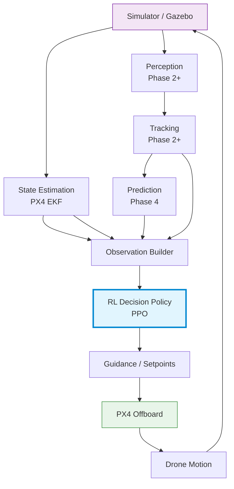
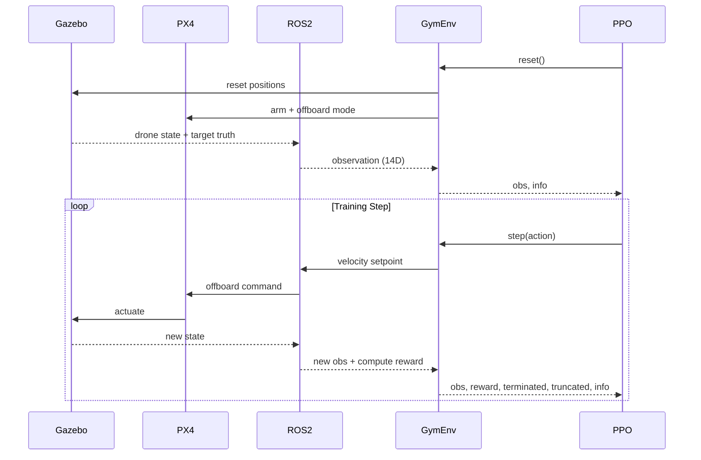
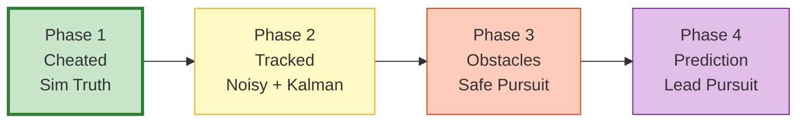

# SPEC025 - Diagrams

## 1. Autonomy Pipeline (All Phases)

```mermaid
graph TD
    SIM[Simulator / Gazebo] --> SE[State Estimation<br/>PX4 EKF]
    SIM --> PERC[Perception<br/>Phase 2+]
    SE --> OBS[Observation Builder]
    PERC --> TRACK[Tracking<br/>Phase 2+]
    TRACK --> PRED[Prediction<br/>Phase 4]
    PRED --> OBS
    TRACK --> OBS
    SE --> OBS
    OBS --> POLICY[RL Decision Policy<br/>PPO]
    POLICY --> GUID[Guidance / Setpoints]
    GUID --> PX4[PX4 Offboard]
    PX4 --> DRONE[Drone Motion]
    DRONE --> SIM

    style POLICY fill:#e1f5fe,stroke:#0288d1,stroke-width:3px
    style SIM fill:#f3e5f5,stroke:#7b1fa2
    style PX4 fill:#e8f5e9,stroke:#388e3c
```

## 2. Phase 1 Data Flow

```mermaid
sequenceDiagram
    participant Gazebo
    participant PX4
    participant ROS2
    participant GymEnv
    participant PPO

    PPO->>GymEnv: reset()
    GymEnv->>Gazebo: reset positions
    GymEnv->>PX4: arm + offboard mode
    Gazebo-->>ROS2: drone state + target truth
    ROS2-->>GymEnv: observation (14D)
    GymEnv-->>PPO: obs, info

    loop Training Step
        PPO->>GymEnv: step(action)
        GymEnv->>ROS2: velocity setpoint
        ROS2->>PX4: offboard command
        PX4->>Gazebo: actuate
        Gazebo-->>ROS2: new state
        ROS2-->>GymEnv: new obs + compute reward
        GymEnv-->>PPO: obs, reward, terminated, truncated, info
    end
```

## 3. Phase Progression

```mermaid
graph LR
    P1[Phase 1<br/>Cheated<br/>Sim Truth] --> P2[Phase 2<br/>Tracked<br/>Noisy + Kalman]
    P2 --> P3[Phase 3<br/>Obstacles<br/>Safe Pursuit]
    P3 --> P4[Phase 4<br/>Prediction<br/>Lead Pursuit]

    style P1 fill:#c8e6c9,stroke:#2e7d32,stroke-width:3px
    style P2 fill:#fff9c4,stroke:#f9a825
    style P3 fill:#ffccbc,stroke:#d84315
    style P4 fill:#e1bee7,stroke:#7b1fa2
```
